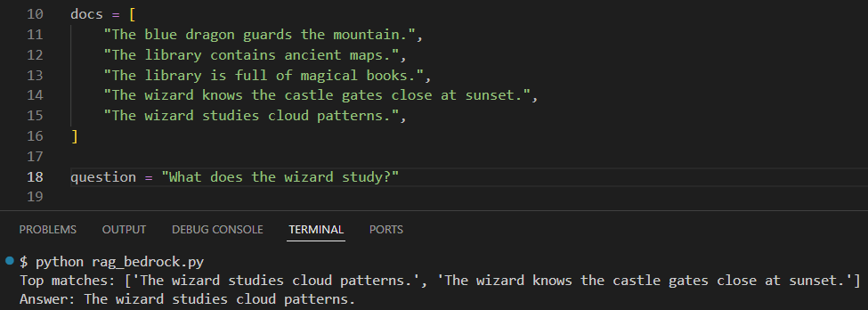
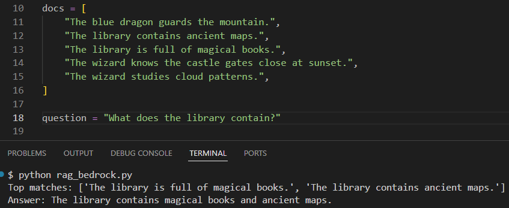

# Tiny RAG Demo with Amazon Bedrock (Beginner-Friendly)

This repo contains a simple Python script that demonstrates how **Retrieval-Augmented Generation (RAG)** works using Amazon Bedrock.

If you’ve ever wondered how AI can “look up” information instead of guessing — this is the smallest possible working example.

It follows the same three steps used in real-world AI systems:

**Retrieve → Augment → Generate**

--- 

### What this project demonstrates

- Using Amazon Titan Embeddings to represent meaning as vectors
- Ranking documents using cosine similarity
- Formatting retrieved results into context (Augment step)
- SSending context + question to Amazon Nova for answer generation
- Enforcing grounded responses with a system instruction (the model answers only using the provided context or says “I don’t know.”)

---

### AHow Tiny RAG Works

#### 1. Retrieve
The question and documents are embedded and ranked by similarity.
The top matches are selected.
#### 2. Augment
The retrieved sentences are formatted into a structured context block.
#### 3. Generate
The context and original question are sent to the text model, which produces a human-readable answer.

This is the exact same pattern used in production RAG systems — just scaled down to make the logic easy to understand.

---

## Quick Start

#### 1) AWS Credentials

Configure your AWS credentials using:
```bash 
aws configure sso
# or 
aws configure
```

Confirm you're authenticated:

```bash
aws sts get-caller-identity
```

#### 2) Create a virtual environment (recommended)
```bash
python -m venv venv
```

Activate it:
```bash
# Windows (Git Bash)
source venv/Scripts/activate

# macOS/Linux
source venv/bin/activate

# Windows (Command Prompt)
venv\Scripts\activate         
```

#### 3) Install dependencies
```bash
pip install boto3
pip install numpy
```

#### (Optional) If you use a named profile:
```bash
export AWS_PROFILE=your-profile-name   # macOS/Linux
setx AWS_PROFILE your-profile-name     # Windows
```

### Run the script
```bash
python rag_bedrock.py
```

---

### Models used

- Embeddings: `amazon.titan-embed-text-v2:0`
- Text generation: `amazon.nova-micro-v1:0`

--- 

### Example Output

#### Q1: What does the wizard study?

The system retrieves two sentences that mention the wizard, but only one actually answers the question.



---

#### Q2: What does the library contain?

The system retrieves two useful sentences that mention the library, and RAG **combines both facts** into one answer:

> "The library contains magical books and ancient maps."

This shows that RAG can sometimes use one piece of context and other times combine multiple pieces.
This is classic RAG - retrieval finds relevant information by meaning, not just keywords.



---

#### Q3: Is the library big or small?

The system responds with: "I don't know. The context does not provide information about the size of the library."

Although the system retrieved information about what’s in the library, there was no mention about its size.

Since that information wasn’t in the context, the model didn’t guess. Instead it said, ‘I don’t know.’

That’s exactly what we want.
RAG helps reduce hallucinations by answering only when the context supports it instead of confidently making something up.


---

### Why This Matters

RAG allows AI systems to stay grounded in real information.

Instead of relying only on what the model “remembers,” it:

- retrieves relevant context
- augments the prompt with that context
- generates an answer based only on the retrieved information

This pattern powers document search, enterprise chatbots, internal knowledge systems, and many modern AI applications.

---

## 🎥 YouTube Walkthrough

Watch the full explanation and demo here:  
[YouTube Video – Tiny RAG with Amazon Bedrock](https://youtu.be/xCqmlW_lp4A)

---
